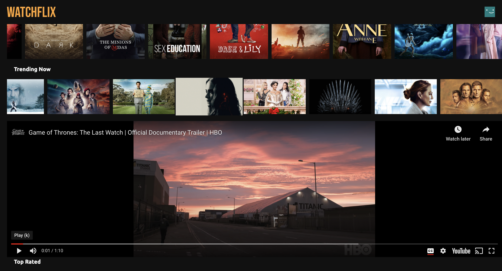

# about

Netflix inspired Movies and TV Shows streaming app built in Javascript, React, TMDb API and Styled Components.

Landing page where the user can browse Movies and TV Shows.


Clicking on a Movie or TV Show poster displays a pop up with the title trailer.



# technologies

- React
- Javascript
- Styled Components

# instructions

1.  clone repository

    ```bash
    git clone https://github.com/ingriddorioschulze/watchflix
    cd watchflix
    ```

2.  install dependencies

    ```bash
    npm install
    ```

3.  start the application

    ```bash
    npm start
    ```
